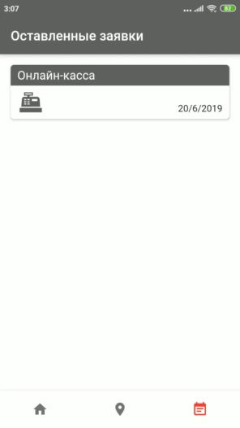
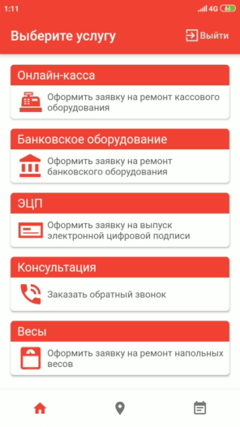
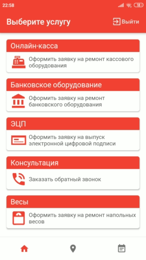

### About

User flow can be described like this:
+ The user starts on the homepage
+ From the homepage user choose what kind of service he would like to request
+ If user is not authorized then he will be promted with authorization dialog
+ User types in his number and verification code that he will get shortly after
+ After succesful authorization user proceed to service form and fill all necessary information
+ User confirms request and waits for proccess to complete
+ After that he gets redirected to homepage
+ User can check either map location of the business on map tab or his request on request tab 

This app gives an idea of how easy you can build your own cross-platform application with working SMS authorization, maps and email integration, by using **Flutter** framework and services such as **Firebase**, **Google Maps** and **Sendgrid**.

### Examples

Authorization procces

Leaving a request

Request logs tab

Map overview

Network check

